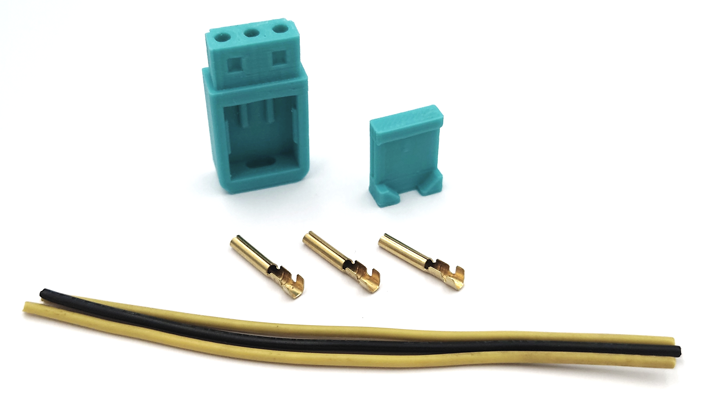

# 3D Printed IBM PC Jr Power plug model
<figure></figure>

 - [Freecad project](freecad/IbmPcJrPowerPlug.FCStd)
 - [Instruction](docs/BUILD.md)
 - Stl files [top](stl/IbmPcJrPowerPlug-PcJrPowerPlugTop.stl) and [bottom](stl/IbmPcJrPowerPlug-PcJrPowerPlugBottom.stl)
