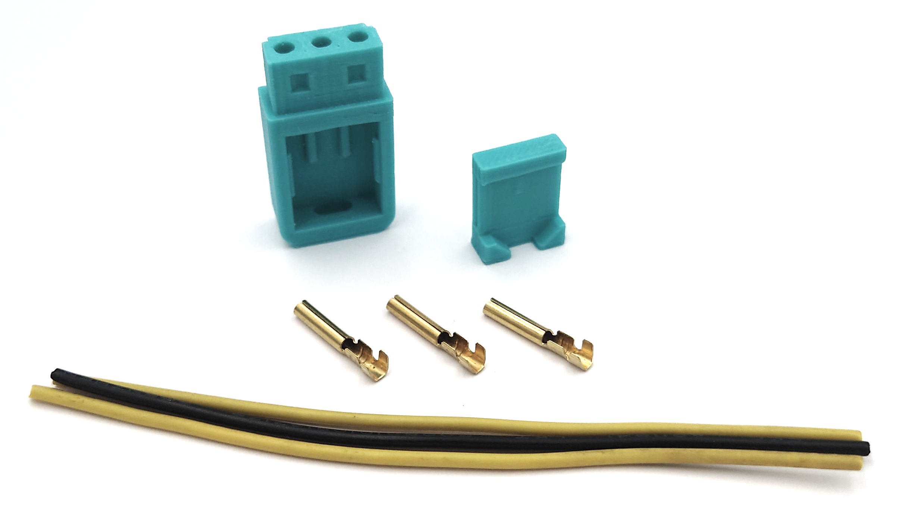

# How to assemble the plug
Get all the parts. Print the [top](../stl/IbmPcJrPowerPlug-PcJrPowerPlugTop.stl) and [bottom](../stl/IbmPcJrPowerPlug-PcJrPowerPlugBottom.stl) parts. Prepare the wires and round plugs.
<figure></figure>
Crimp the wires.
<figure></figure>
Insert plugs into bottom part.
<figure></figure>
Insert the top part and press hard to lock.
<figure></figure>
Solder wires to power supply or socket.
<figure></figure>